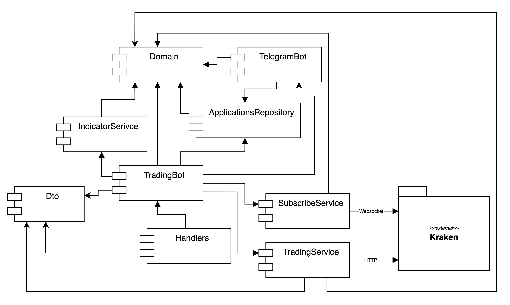

# Курсовой проект TFS: Golang

Доступен на: [https://willsem.online:8080](https://willsem.online:8080)

## Архитектура приложения



## REST API

#### Тело всех ответов

```
{
    message: string
}
```

### Проверка работы сервера

`GET /trading/health`

#### Ответы

* 200 OK

### Приостановить работу бота

`PUT /trading/pause`

#### Ответы

* 200 OK
* 400 Bad Request

### Возобновить работу бота

`PUT /trading/continue`

#### Ответы

* 200 OK
* 400 Bad Request

### Тикеры с которыми сейчас работает бот

`GET /trading/tickers`

#### Ответы

* 200 OK, **Тело:** `[string]`

### Добавить тикер для покупок

`POST /trading/ticker/{ticker}/add`

#### Ответы

* 200 OK
* 400 Bad Request
* 500 Internal Server Error

### Убрать тикер для покупок

`DELETE /trading/ticker/{ticker}/remove`

* 200 OK
* 400 Bad Request
* 500 Internal Server Error

#### Ответы

### Изменить размеры покупок и продаж

`PUT /trading/setup/size/{size}`

#### Ответы

* 200 OK
* 400 Bad Request
